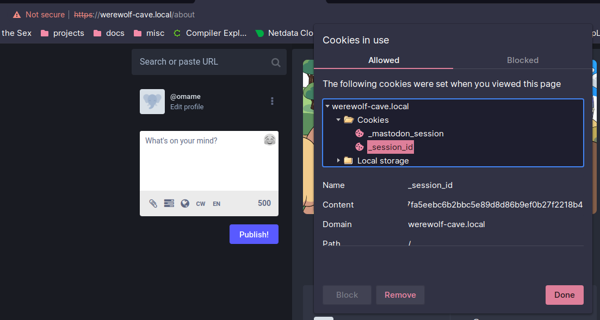

# Mastodon Mutant Emoji

This script allows you to upload the full [Mutant Standard emoji set](https://mutant.tech) into Mastodon.

To use it, run `main.py` and follow the instructions. Make sure you have installed all the requirements in `requirements.txt`, like so:
```commandline
pip install -r requirements.txt
```

If you fuck up during the configuration, you can remove the `.config.json` file the script creates.

**You can get your session ID by opening your cookies.**


Remember that **you are required to include an attribute notice**, as per the Creative Commons BY-NC-SA 4.0 license.

Include this paragraph at the bottom of your instance's extended description. 
```html
<p>This instance uses <a href='https://mutant.tech'>Mutant Standard emoji</a>, which are licensed under a <a href='https://creativecommons.org/licenses/by-nc-sa/4.0/'>CC BY-NC-SA 4.0 International License</a>.</p>
```
